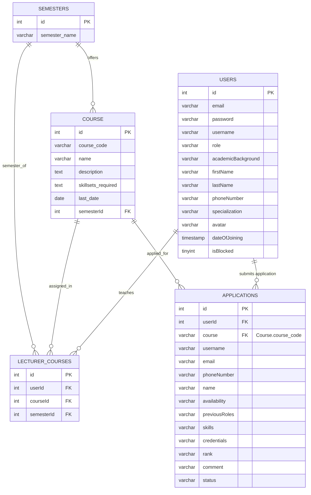

```mermaid
erDiagram
    USERS {
        int     id PK
        varchar email
        varchar password
        varchar username
        varchar role
        varchar academicBackground
        varchar firstName
        varchar lastName
        varchar phoneNumber
        varchar specialization
        varchar avatar
        timestamp dateOfJoining
        tinyint isBlocked
    }
    SEMESTERS {
        int     id PK
        varchar semester_name
    }
    COURSE {
        int     id PK
        varchar course_code
        varchar name
        text    description
        text    skillsets_required
        date    last_date
        int     semesterId FK
    }
    LECTURER_COURSES {
        int id PK
        int userId     FK
        int courseId   FK
        int semesterId FK
    }
    APPLICATIONS {
        int     id PK
        int     userId               FK
        varchar course              FK "Course.course_code"
        varchar username
        varchar email
        varchar phoneNumber
        varchar name
        varchar availability
        varchar previousRoles
        varchar skills
        varchar credentials
        varchar rank
        varchar comment
        varchar status
    }

    %% relationships
    USERS                ||--o{ LECTURER_COURSES  : teaches
    COURSE               ||--o{ LECTURER_COURSES  : assigned_in
    SEMESTERS            ||--o{ LECTURER_COURSES  : semester_of

    SEMESTERS            ||--o{ COURSE             : offers

    USERS                ||--o{ APPLICATIONS       : "submits application"
    COURSE               ||--o{ APPLICATIONS       : "applied_for"
```
